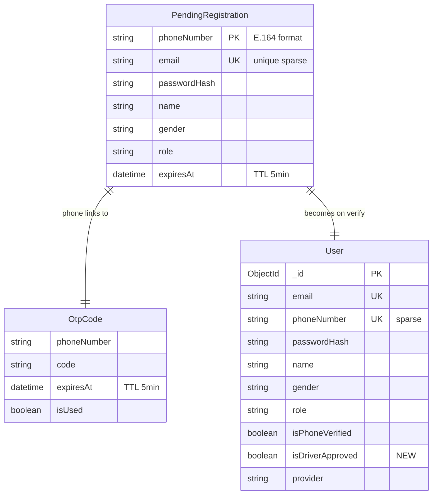

# Data Model: Registration & Phone Verification Flow Restructure

## New Entity: PendingRegistration

A temporary server-side record holding registration data until OTP verification succeeds.

```
Collection: pending_registrations
TTL: 5 minutes (MongoDB TTL index on expiresAt)
```

| Field | Type | Required | Constraints | Description |
|-------|------|----------|-------------|-------------|
| `phoneNumber` | String | Yes | E.164 format, **unique index** | Primary key — one pending registration per phone |
| `email` | String | Yes | Valid email, **unique index (sparse)** | Must not conflict with User.email or other pending records |
| `passwordHash` | String | Yes | bcrypt hash | Hashed password (never stored as plain text) |
| `name` | String | Yes | 2-100 chars | User's display name |
| `gender` | Enum | No | `male` \| `female` | User's gender |
| `role` | Enum | Yes | `passenger` \| `driver` | Intended role after registration |
| `expiresAt` | Date | Yes | Auto-set: now + 5min | TTL trigger for MongoDB auto-deletion |
| `createdAt` | Date | Yes | Auto (timestamps) | Record creation time |
| `updatedAt` | Date | Yes | Auto (timestamps) | Last update time |

### Indexes
- `phoneNumber: 1` — unique index (natural key)
- `email: 1` — unique sparse index (prevent duplicate pending emails)
- `expiresAt: 1` — TTL index with `expireAfterSeconds: 0`

### Lifecycle
```
Created → [OTP verified] → Deleted (data used to create User)
Created → [5 min TTL expired] → Auto-deleted by MongoDB
Created → [Re-registration same phone] → Overwritten with new data
```

---

## Modified Entity: User

### New Fields

| Field | Type | Required | Default | Description |
|-------|------|----------|---------|-------------|
| `isDriverApproved` | Boolean | Yes | `false` | Whether admin has approved this driver. Only relevant for `role=driver`. Passengers always have this as `false` (ignored). |

### Existing Fields — Behavior Changes

| Field | Change |
|-------|--------|
| `phoneNumber` | Now **required at registration** (was optional). Unique sparse index already exists. |
| `isPhoneVerified` | Always `true` for new users (since accounts are only created after OTP verification). Legacy users may have `false`. |
| `provider` | New registrations always set to `AuthProvider.EMAIL` (since registration is via email+phone, but email is the primary auth method). |

### Updated Schema (additions only)
```typescript
@Prop({
  type: Boolean,
  required: true,
  default: false,
})
isDriverApproved: boolean;
```

---

## Modified DTO: SignUpDto

### Current Fields
| Field | Type | Required |
|-------|------|----------|
| `email` | String | Yes |
| `password` | String | Yes |
| `name` | String | Yes |
| `gender` | Enum | No |

### Added Fields
| Field | Type | Required | Constraints |
|-------|------|----------|-------------|
| `phoneNumber` | String | **Yes** | E.164 format (`/^\+[1-9]\d{1,14}$/`) |
| `role` | Enum | No | `passenger` (default) \| `driver` |

---

## Modified DTO: VerifyOtpDto

### Fields (unchanged)
| Field | Type | Required |
|-------|------|----------|
| `phoneNumber` | String | Yes |
| `code` | String | Yes |

**Behavior change**: The endpoint logic now checks for a `PendingRegistration` by phone number. If found → create user. If not found → treat as existing-user phone verification (linkPhone flow).

---

## Modified Model: UserModel (Flutter)

### Added Fields
| Field | Type | Default | Description |
|-------|------|---------|-------------|
| `isDriverApproved` | bool | `false` | Mapped from backend `isDriverApproved` |

### Updated Factory
```dart
// In UserModel.fromJson():
isDriverApproved: json['isDriverApproved'] ?? false,
```

---

## Entity Relationship Diagram


