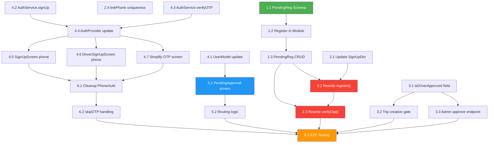

# Implementation Plan: Registration & Phone Verification Flow Restructure

**Feature Branch**: `004-fix-registration-phone-flow`
**Spec**: [spec.md](file:///c:/Users/HP/Desktop/mahoudmsq/specs/004-fix-registration-phone-flow/spec.md)
**Created**: 2026-03-06

## Technical Context

| Item | Value |
|------|-------|
| **Backend** | NestJS + TypeScript + MongoDB (Mongoose) |
| **Frontend** | Flutter + Dart |
| **OTP Provider** | Twilio Verify |
| **Auth** | JWT (access + refresh tokens) |
| **Password Hashing** | bcrypt |
| **Backend Port** | 3003 |
| **API Prefix** | `/api/v1` |

## Design Artifacts

| Artifact | Path | Status |
|----------|------|--------|
| Specification | [spec.md](file:///c:/Users/HP/Desktop/mahoudmsq/specs/004-fix-registration-phone-flow/spec.md) | ✅ Complete |
| Research | [research.md](file:///c:/Users/HP/Desktop/mahoudmsq/specs/004-fix-registration-phone-flow/research.md) | ✅ Complete |
| Data Model | [data-model.md](file:///c:/Users/HP/Desktop/mahoudmsq/specs/004-fix-registration-phone-flow/data-model.md) | ✅ Complete |
| API Contracts | [api-endpoints.md](file:///c:/Users/HP/Desktop/mahoudmsq/specs/004-fix-registration-phone-flow/contracts/api-endpoints.md) | ✅ Complete |
| Quickstart | [quickstart.md](file:///c:/Users/HP/Desktop/mahoudmsq/specs/004-fix-registration-phone-flow/quickstart.md) | ✅ Complete |

---

## Implementation Phases

### Phase 1 — Backend: PendingRegistration Schema & Service (Foundation)

**Goal**: Create the data layer for temporary registration storage.

**Tasks**:

#### Task 1.1: Create PendingRegistration Schema
- **File**: `rideshare-backend/src/modules/users/schemas/pending-registration.schema.ts` (NEW)
- **Action**: Create Mongoose schema with fields: `phoneNumber` (unique), `email` (unique sparse), `passwordHash`, `name`, `gender`, `role`, `expiresAt` (TTL 5 min)
- **Indexes**: `phoneNumber: 1` (unique), `email: 1` (unique sparse), `expiresAt: 1` (TTL `expireAfterSeconds: 0`)
- **Pattern**: Follow existing `otp-code.schema.ts` for TTL pattern
- **Tests**: Schema validates E.164 phone format, rejects duplicates
- **Depends on**: Nothing

#### Task 1.2: Register PendingRegistration in UsersModule
- **File**: `rideshare-backend/src/modules/users/users.module.ts`
- **Action**: Add `MongooseModule.forFeature([{ name: PendingRegistration.name, schema: PendingRegistrationSchema }])` to imports
- **Depends on**: Task 1.1

#### Task 1.3: Add PendingRegistration CRUD to UsersService
- **File**: `rideshare-backend/src/modules/users/users.service.ts`
- **Action**: Add methods:
  - `createPendingRegistration(data)` — creates or overwrites (upsert by phoneNumber)
  - `findPendingByPhone(phoneNumber)` — finds pending record
  - `findPendingByEmail(email)` — finds pending record by email
  - `deletePendingByPhone(phoneNumber)` — removes after successful verification
- **Depends on**: Task 1.2

---

### Phase 2 — Backend: Refactor Auth Service (Core Fix)

**Goal**: Rewrite `register()` to defer account creation and fix `verifyOtp()` to create accounts.

**Tasks**:

#### Task 2.1: Update SignUpDto
- **File**: `rideshare-backend/src/modules/auth/dto/sign-up.dto.ts`
- **Action**: Add `phoneNumber` (required, E.164 regex, `@IsPhoneNumber()` or `@Matches()`) and `role` (optional, enum `passenger|driver`, default `passenger`)
- **Depends on**: Nothing

#### Task 2.2: Rewrite AuthService.register()
- **File**: `rideshare-backend/src/modules/auth/auth.service.ts`
- **Action**:
  1. Validate email not in User table
  2. Validate phone not in User table
  3. Validate email not in PendingRegistration (different phone)
  4. Hash password with bcrypt
  5. Upsert PendingRegistration (keyed by phone, overwrites if same phone)
  6. Call `sendOtp(phoneNumber)` to send OTP via Twilio
  7. Return `{ message, phoneNumber, expiresAt }` — NO tokens, NO user creation
- **Breaking change**: Response format changes (no more user/tokens in register response)
- **Depends on**: Task 1.3, Task 2.1

#### Task 2.3: Rewrite AuthService.verifyOtp()
- **File**: `rideshare-backend/src/modules/auth/auth.service.ts`
- **Action**:
  1. Verify OTP code (existing Twilio/OtpCode logic)
  2. Check `PendingRegistration` for this phone number
  3. **If pending found**: Create User from pending data with `isPhoneVerified=true`, delete pending record, generate tokens, return user + tokens
  4. **If no pending found**: Check if existing User has this phone → update `isPhoneVerified=true` (linkPhone fallback)
  5. **If neither**: Return 404 error
  6. **CRITICAL**: Remove the old logic that creates a new User with `provider=PHONE` when no user is found
- **Depends on**: Task 1.3, Task 2.2

#### Task 2.4: Update AuthService.linkPhone() — Add Uniqueness Check
- **File**: `rideshare-backend/src/modules/auth/auth.service.ts`
- **Action**: Before linking phone, check if phone is already assigned to another user. If so, throw ConflictException with Arabic message.
- **Depends on**: Nothing (can be done in parallel)

---

### Phase 3 — Backend: Driver Approval Gate

**Goal**: Add `isDriverApproved` field and enforce it on trip creation.

**Tasks**:

#### Task 3.1: Add isDriverApproved to User Schema
- **File**: `rideshare-backend/src/modules/users/schemas/user.schema.ts`
- **Action**: Add `isDriverApproved: boolean` field with `default: false`
- **Depends on**: Nothing

#### Task 3.2: Add Driver Approval Check to Trip Creation
- **File**: `rideshare-backend/src/modules/trips/trips.service.ts`
- **Action**: In `create()` method, after the existing `vehicle.isVerified` check, add a check for `user.isDriverApproved`. Need to inject `UsersService` to fetch the user.
- **Depends on**: Task 3.1

#### Task 3.3: Add Admin Approve Driver Endpoint
- **Files**: `rideshare-backend/src/modules/admin/admin.controller.ts`, `admin.service.ts`, `dto/admin-query.dto.ts`
- **Action**:
  - Add `PATCH /admin/users/:id/approve-driver` endpoint
  - Accept `{ approved: boolean }` body
  - Validate user exists and has `role=driver`
  - Update `isDriverApproved` field
  - Return updated user
- **Depends on**: Task 3.1

---

### Phase 4 — Frontend: Update Registration Screens

**Goal**: Add phone number field to sign-up forms and update the registration flow.

**Tasks**:

#### Task 4.1: Update UserModel
- **File**: `rideshare/lib/models/user_model.dart`
- **Action**: Add `isDriverApproved` field with `fromJson` mapping and `copyWith` support
- **Depends on**: Nothing

#### Task 4.2: Update AuthService.signUp()
- **File**: `rideshare/lib/core/services/auth_service.dart`
- **Action**:
  - Add `phoneNumber` and `role` parameters to `signUp()` method
  - Send phoneNumber in the registration request body
  - Update response handling: no longer expect tokens or user in response (just success + phoneNumber)
  - Return phone number and expiry time instead of UserModel
- **Depends on**: Nothing

#### Task 4.3: Update AuthService.verifyOTP()
- **File**: `rideshare/lib/core/services/auth_service.dart`
- **Action**: Update to handle new response format where verify-otp now returns user + tokens for new registrations
- **Depends on**: Nothing

#### Task 4.4: Update AuthProvider
- **File**: `rideshare/lib/providers/auth_provider.dart`
- **Action**:
  - Update `signUpWithEmailAndPassword()` to accept `phoneNumber` parameter
  - Change flow: signUp → navigate to OTP screen (no tokens yet)
  - After OTP success: save tokens and user data received from verifyOTP
  - Remove `linkPhone` call from registration flow (no longer needed)
- **Depends on**: Task 4.2, Task 4.3

#### Task 4.5: Add Phone Number Field to SignUpScreen
- **File**: `rideshare/lib/screens/auth/sign_up_screen.dart`
- **Action**:
  - Add phone number input field (with country code selector, default +20)
  - Add phone validation
  - Update form submission to include phone number
  - After submission success: navigate directly to OTP screen with phone number
  - Remove navigation to PhoneAuthScreen (no longer needed in registration flow)
- **Depends on**: Task 4.4

#### Task 4.6: Add Phone Number Field to DriverSignUpScreen
- **File**: `rideshare/lib/screens/auth/driver_sign_up_screen.dart`
- **Action**: Same changes as Task 4.5 but for driver registration screen. Pass `role: 'driver'` in registration request.
- **Depends on**: Task 4.4

#### Task 4.7: Simplify OTP Verification Screen
- **File**: `rideshare/lib/screens/auth/otp_verification_screen.dart`
- **Action**:
  - Remove complex branching logic (isSignIn, isLinkPhone, etc.)
  - For registration flow: receive phone number from args, verify OTP, receive tokens from response, navigate to home (passenger) or vehicle profile (driver)
  - Remove direct user creation logic from OTP callback
- **Depends on**: Task 4.4

---

### Phase 5 — Frontend: Driver Pending Approval Screen

**Goal**: Create the pending approval screen and add routing logic.

**Tasks**:

#### Task 5.1: Create DriverPendingApprovalScreen
- **File**: `rideshare/lib/screens/driver/driver_pending_approval_screen.dart` (NEW)
- **Action**:
  - Show "awaiting admin approval" status with animation/icon
  - Display submitted data summary (name, vehicle info)
  - Show only profile view and logout options
  - No navigation to trip management or creation
  - Design should match app's existing visual style
- **Depends on**: Task 4.1

#### Task 5.2: Add Routing Logic for Non-Approved Drivers
- **File**: `rideshare/lib/providers/auth_provider.dart` (or routing configuration file)
- **Action**:
  - After login/auth check: if `user.role == 'driver'` AND `user.isDriverApproved == false` → navigate to DriverPendingApprovalScreen
  - On profile refresh: if `isDriverApproved` changed to `true` → navigate to normal home
- **Depends on**: Task 5.1, Task 4.1

---

### Phase 6 — Cleanup & Testing

**Goal**: Remove dead code and verify the complete flow.

**Tasks**:

#### Task 6.1: Clean Up PhoneAuthScreen Usage
- **File**: `rideshare/lib/screens/auth/phone_auth_screen.dart`
- **Action**: Keep the screen but remove it from the registration flow navigation. It's only used for phone-change scenarios now.
- **Depends on**: Phase 4

#### Task 6.2: Update skipOTP Handling
- **File**: `rideshare/lib/core/constants/app_constants.dart` and related files
- **Action**: Ensure `skipOTP` dev flag works with the new flow (skip both sending and verification in dev mode)
- **Depends on**: Phase 4

#### Task 6.3: End-to-End Testing
- **Action**: Test all flows:
  1. Passenger registration → OTP → home screen ✓
  2. Driver registration → OTP → vehicle profile → pending approval ✓
  3. Duplicate email rejection ✓
  4. Duplicate phone rejection ✓
  5. Re-registration (overwrite pending) ✓
  6. Login after registration ✓
  7. Existing user linkPhone ✓
  8. Driver approval → trip creation ✓
  9. Legacy users (no phone) can still login ✓
- **Depends on**: All previous phases

---

## Task Dependency Graph

**Legend**: 🟢 Foundation | 🔴 Critical Fix | 🔵 New Feature | 🟠 Validation

---

## Parallelization Opportunities

| Parallel Group | Tasks | Notes |
|---------------|-------|-------|
| **Group A** (Backend foundation) | 1.1 → 1.2 → 1.3 | Sequential, must be first |
| **Group B** (Backend independent) | 2.1, 2.4, 3.1 | Can run in parallel with Group A |
| **Group C** (Frontend independent) | 4.1, 4.2, 4.3 | Can run in parallel with Groups A & B |
| **Group D** (Backend core fix) | 2.2, 2.3 | Depends on Groups A & B |
| **Group E** (Backend approval) | 3.2, 3.3 | Depends on 3.1 only |
| **Group F** (Frontend assembly) | 4.4 → 4.5, 4.6, 4.7 | Depends on 4.2, 4.3 |
| **Group G** (Frontend approval) | 5.1 → 5.2 | Depends on 4.1 |
| **Group H** (Cleanup) | 6.1 → 6.2 → 6.3 | Depends on all above |

## Risk Assessment

| Risk | Impact | Mitigation |
|------|--------|------------|
| Existing user data with phone numbers may conflict with new uniqueness constraints | High | Run a pre-migration check for duplicate phones before deploying |
| Twilio OTP in dev mode (skipOTP) may bypass the new pending registration flow | Medium | Ensure skipOTP creates a mock pending registration for testing |
| Frontend may cache old registration response format | Medium | Clear app storage / force update after deployment |
| MongoDB TTL index may have delay in cleaning up expired pending records | Low | TTL cleanup happens within ~60 seconds; acceptable for 5-minute window |
