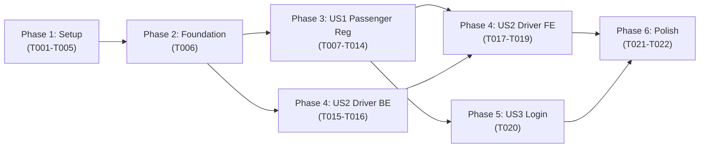

# Tasks: Registration & Phone Verification Flow Restructure

**Feature Branch**: `004-fix-registration-phone-flow`
**Created**: 2026-03-06
**Total Tasks**: 22
**User Stories**: US1 (Passenger Registration), US2 (Driver Registration + Approval), US3 (Login After Registration)

---

## Phase 1: Setup

**Goal**: No new project setup needed — this is a refactor of existing codebases.

- [X] T001 [P] Create `PendingRegistration` Mongoose schema with fields (`phoneNumber`, `email`, `passwordHash`, `name`, `gender`, `role`, `expiresAt`) and indexes (`phoneNumber` unique, `email` unique sparse, `expiresAt` TTL) in `rideshare-backend/src/modules/users/schemas/pending-registration.schema.ts`
- [X] T002 Register `PendingRegistration` schema in MongooseModule.forFeature within `rideshare-backend/src/modules/users/users.module.ts`
- [X] T003 [P] Add `phoneNumber` field (required, E.164 regex `@Matches(/^\+[1-9]\d{1,14}$/)`) and `role` field (optional, enum `passenger|driver`, default `passenger`) to `rideshare-backend/src/modules/auth/dto/sign-up.dto.ts`
- [X] T004 [P] Add `isDriverApproved` boolean field (required, default `false`) to User schema in `rideshare-backend/src/modules/users/schemas/user.schema.ts`
- [X] T005 [P] Add `isDriverApproved` field with `fromJson` mapping (`json['isDriverApproved'] ?? false`) and `copyWith` support to Flutter `UserModel` in `rideshare/lib/models/user_model.dart`

---

## Phase 2: Foundational (Blocking Prerequisites)

**Goal**: Build the pending registration data layer that all user stories depend on.

- [X] T006 Add four PendingRegistration CRUD methods to `UsersService` in `rideshare-backend/src/modules/users/users.service.ts`: `createPendingRegistration(data)` (upsert by phoneNumber), `findPendingByPhone(phoneNumber)`, `findPendingByEmail(email)`, `deletePendingByPhone(phoneNumber)`. Inject `PendingRegistration` model in constructor.

---

## Phase 3: User Story 1 — Passenger Registration with Phone Verification (P1)

**Story Goal**: A passenger registers with name, email, password, gender, and phone number. The system stores data temporarily, sends OTP. After OTP verification, a single user account is created. No duplicate accounts.

**Independent Test**: Register a passenger with email + phone → verify OTP → confirm exactly ONE user record in database with both email and phone linked, `isPhoneVerified=true`.

### Backend

- [X] T007 [US1] Rewrite `AuthService.register()` in `rideshare-backend/src/modules/auth/auth.service.ts`: (1) Validate email not in User table, (2) validate phoneNumber not in User table, (3) validate email not in PendingRegistration with different phone, (4) hash password with bcrypt, (5) upsert PendingRegistration keyed by phoneNumber, (6) call `sendOtp(phoneNumber)`, (7) return `{ message: "OTP sent successfully", phoneNumber, expiresAt }` — NO tokens, NO user creation. Import and use `UsersService` pending registration methods.
- [X] T008 [US1] Rewrite `AuthService.verifyOtp()` in `rideshare-backend/src/modules/auth/auth.service.ts`: (1) Verify OTP code using existing OtpCode logic, (2) check PendingRegistration for this phone, (3) if pending found: create User from pending data with `isPhoneVerified=true` and `provider=EMAIL`, delete pending record, generate JWT tokens, return `{ user, accessToken, refreshToken }`, (4) if no pending: check existing User by phone → update `isPhoneVerified=true` (linkPhone fallback), (5) if neither: throw NotFoundException. **CRITICAL**: Remove the old logic at line ~190-199 that creates a new User with `provider=PHONE`.
- [X] T009 [P] [US1] Add phone number uniqueness check to `AuthService.linkPhone()` in `rideshare-backend/src/modules/auth/auth.service.ts`: Before linking, call `usersService.findByPhone(phoneNumber)` and if found and `foundUser._id !== currentUserId`, throw `ConflictException('رقم الهاتف مرتبط بحساب آخر')`.

### Frontend

- [X] T010 [US1] Update `AuthService.signUp()` in `rideshare/lib/core/services/auth_service.dart`: (1) Add `phoneNumber` and `role` parameters, (2) include `phoneNumber` and `role` in request body, (3) change return type — no longer returns `UserModel` (no tokens/user in response), (4) return a `Map<String, dynamic>` with `phoneNumber` and `expiresAt` from response. Do NOT save tokens (account doesn't exist yet).
- [X] T011 [US1] Update `AuthService.verifyOTP()` in `rideshare/lib/core/services/auth_service.dart`: Ensure it handles the new response where `verify-otp` returns `user + accessToken + refreshToken` for new registrations. Save tokens and userId via `_tokenStorage`, set `_currentUser`, and return `UserModel`.
- [X] T012 [US1] Update `AuthProvider.signUpWithEmailAndPassword()` in `rideshare/lib/providers/auth_provider.dart`: (1) Add `phoneNumber` parameter, (2) call `authService.signUp()` with phone and role, (3) on success: navigate to OTP verification screen passing `phoneNumber` as argument (NOT to PhoneAuthScreen), (4) remove any `linkPhone` call from registration flow.
- [X] T013 [US1] Add phone number input field with country code selector (default `+20`) to passenger sign-up form in `rideshare/lib/screens/auth/sign_up_screen.dart`: (1) Add `TextFormField` or `intl_phone_field` widget for phone input, (2) add E.164 format validation, (3) update `_signUp()` method to pass `phoneNumber` to `authProvider.signUpWithEmailAndPassword()`, (4) after success: navigate directly to OTP verification screen with `phoneNumber` argument (remove navigation to PhoneAuthScreen).
- [X] T014 [US1] Simplify OTP verification screen in `rideshare/lib/screens/auth/otp_verification_screen.dart`: (1) For registration flow: receive `phoneNumber` from route arguments, (2) on successful OTP verification: save tokens received from `verifyOTP()` response, (3) navigate to home screen for passengers, (4) remove complex branching logic (`isSignIn`, `isLinkPhone` flags) — keep only: `isRegistration` and `isDriverRegistration` flows. Keep `isLinkPhone` only for the phone-change scenario (not registration).

---

## Phase 4: User Story 2 — Driver Registration with Approval Gate (P1)

**Story Goal**: A driver registers with phone number, verifies OTP, completes vehicle profile. Driver cannot create trips until admin approves. Non-approved drivers see a dedicated "pending approval" screen.

**Independent Test**: Register as driver → verify OTP → complete vehicle → attempt trip creation → get rejected → admin approves → trip creation succeeds. Also: non-approved driver login → see pending approval screen.

### Backend

- [X] T015 [US2] Add `isDriverApproved` check to `TripsService.create()` in `rideshare-backend/src/modules/trips/trips.service.ts`: (1) Inject `UsersService` into `TripsService` constructor (update `trips.module.ts` imports if needed), (2) after existing `vehicle.isVerified` check, fetch user by `driverId` and check `user.isDriverApproved === false` → throw `ForbiddenException('حسابك كسائق قيد المراجعة. لا يمكنك إنشاء رحلات حتى يتم الموافقة عليه.')`.
- [X] T016 [US2] Add admin approve-driver endpoint: (1) Add `ApproveDriverDto` with `approved: boolean` field to `rideshare-backend/src/modules/admin/dto/admin-query.dto.ts`, (2) add `approveDriver(userId, approved)` method to `rideshare-backend/src/modules/admin/admin.service.ts` that validates user is a driver and updates `isDriverApproved`, (3) add `PATCH /admin/users/:id/approve-driver` route to `rideshare-backend/src/modules/admin/admin.controller.ts` with `@Roles('admin')` guard.
- [X] T017 [US2] Add phone number input field to driver sign-up form in `rideshare/lib/screens/auth/driver_sign_up_screen.dart`: Same changes as T013 but pass `role: 'driver'` in registration request. After OTP success, navigate to `driverCompleteProfile` route (not home).
- [X] T018 [US2] Create `DriverPendingApprovalScreen` in `rideshare/lib/screens/driver/driver_pending_approval_screen.dart` (NEW file): (1) Show centered "awaiting admin approval" icon/animation with Arabic text `"حسابك قيد المراجعة"`, (2) display submitted profile summary (name, email, phone), (3) show only "عرض الملف الشخصي" and "تسجيل خروج" buttons, (4) NO navigation to trip management or trip creation, (5) style consistently with existing app theme.
- [X] T019 [US2] Add routing logic for non-approved drivers: In `rideshare/lib/providers/auth_provider.dart` (or app routing configuration), after successful login or auth state check: if `user.role == 'driver'` AND `user.isDriverApproved == false`, navigate to `DriverPendingApprovalScreen` instead of home. On profile refresh, if `isDriverApproved` becomes `true`, navigate to normal driver home.

---

## Phase 5: User Story 3 — Login After Registration (P2)

**Story Goal**: Previously registered users can log in normally. Users who abandoned registration before OTP don't have accounts (no login possible). No regression for legacy users.

**Independent Test**: Register and complete OTP → log out → log back in with email/password → success. Try login with email from abandoned registration → "invalid credentials".

- [X] T020 [US3] Verify login flow compatibility in `rideshare-backend/src/modules/auth/auth.service.ts`: Confirm `login()` method works without changes — it already authenticates by email/password against User table. Since deferred creation means no User exists until OTP completes, abandoned registrations naturally return "invalid credentials". No code changes expected — verify and document.

---

## Phase 6: Polish & Cross-Cutting Concerns

**Goal**: Clean up dead code, ensure dev mode works, and validate all flows end-to-end.

- [X] T021 Remove `PhoneAuthScreen` from registration flow navigation in relevant files: (1) In `rideshare/lib/screens/auth/sign_up_screen.dart` remove any navigation to `phoneAuth` route after sign-up (already replaced by direct OTP navigation in T013), (2) in `rideshare/lib/screens/auth/driver_sign_up_screen.dart` remove navigation to `phoneAuth` route (already replaced in T017), (3) keep `PhoneAuthScreen` itself intact for phone-change scenarios, (4) update `rideshare/lib/core/constants/app_constants.dart` to ensure `skipOTP` dev flag works with new flow — when `skipOTP=true`, bypass OTP sending in `AuthService.signUp()` and auto-verify in `verifyOTP()`.
- [X] T022 End-to-end manual verification: Test all 9 flows: (1) passenger registration → OTP → home, (2) driver registration → OTP → vehicle profile → pending approval screen, (3) duplicate email rejection at registration, (4) duplicate phone rejection at registration, (5) re-registration with same phone overwrites pending record, (6) login after successful registration, (7) existing user linkPhone still works, (8) admin approves driver → driver can create trip, (9) legacy users without phone can still login. Document any failures.

---

## Dependencies

### User Story Completion Order



### Key Dependencies

| Task | Depends On | Reason |
|------|-----------|--------|
| T006 | T001, T002 | CRUD needs schema registered in module |
| T007 | T003, T006 | register() needs DTO + pending CRUD |
| T008 | T006, T007 | verifyOtp() needs pending CRUD + register flow |
| T012 | T010, T011 | AuthProvider needs updated AuthService |
| T013 | T012 | UI screen needs updated AuthProvider |
| T014 | T012 | OTP screen needs updated AuthProvider |
| T015 | T004 | Trip gate needs isDriverApproved field |
| T017 | T012 | Driver screen reuses passenger AuthProvider changes |
| T019 | T005, T018 | Routing needs UserModel + approval screen |
| T022 | All | E2E test depends on everything |

---

## Parallel Execution Opportunities

### Round 1 (Independent — can all run simultaneously)
```
T001 (PendingReg schema)  ←→  T003 (SignUpDto)  ←→  T004 (User schema)  ←→  T005 (Flutter UserModel)
```

### Round 2 (After Round 1)
```
T002 (Register in module) → T006 (CRUD methods)
T009 (linkPhone uniqueness) — independent
T010 (Flutter AuthService.signUp) — independent
T011 (Flutter AuthService.verifyOTP) — independent
```

### Round 3 (After Round 2)
```
T007 (Rewrite register) → T008 (Rewrite verifyOtp)
T012 (AuthProvider update) — depends on T010, T011
T015 (Trip creation gate) — depends on T004
T016 (Admin approve endpoint) — depends on T004
```

### Round 4 (After Round 3)
```
T013 (SignUp screen)  ←→  T014 (OTP screen)  ←→  T017 (Driver SignUp screen)
T018 (Pending approval screen) — depends on T005
```

### Round 5 (After Round 4)
```
T019 (Routing logic) — depends on T018
T020 (Login verification) — depends on T008
T021 (Cleanup) — depends on T013, T014, T017
```

### Round 6 (Final)
```
T022 (E2E testing) — depends on everything
```

---

## Implementation Strategy

### MVP Scope (User Story 1 only)
Tasks: T001 → T002 → T003 → T006 → T007 → T008 → T009 → T010 → T011 → T012 → T013 → T014

**Delivers**: Working passenger registration with phone included, OTP verification creates single account, no duplicate accounts. This alone solves the primary bug.

### Increment 2 (Add US2)
Tasks: T004 → T005 → T015 → T016 → T017 → T018 → T019

**Delivers**: Driver registration with approval gate, pending approval screen.

### Increment 3 (Add US3 + Polish)
Tasks: T020 → T021 → T022

**Delivers**: Login flow validation, cleanup, and full E2E testing.

---

## Summary

| Metric | Value |
|--------|-------|
| **Total Tasks** | 22 |
| **US1 Tasks** | 8 (T007-T014) |
| **US2 Tasks** | 5 (T015-T019) |
| **US3 Tasks** | 1 (T020) |
| **Setup Tasks** | 5 (T001-T005) |
| **Foundation Tasks** | 1 (T006) |
| **Polish Tasks** | 2 (T021-T022) |
| **Parallelizable Tasks** | 9 (marked with [P]) |
| **Max Parallel Rounds** | 6 |
| **MVP Task Count** | 12 (US1 only) |
